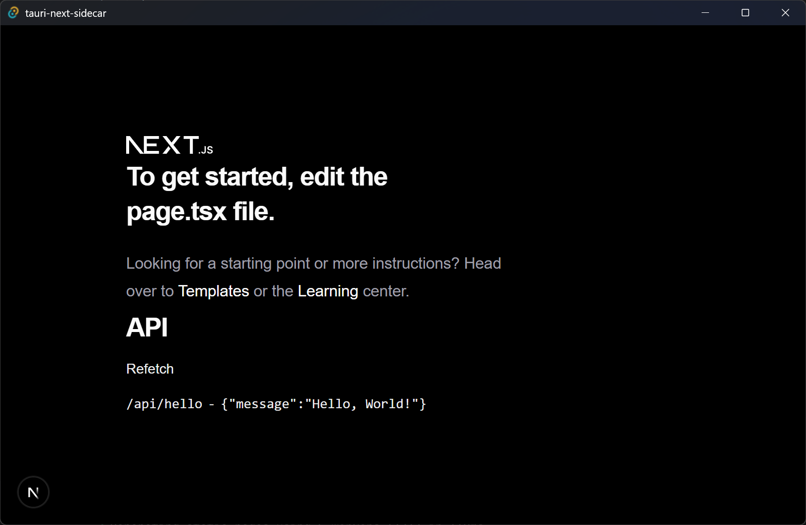

# tauri-next-sidecar

Minimum Use Case for Supporting Next.js (SSR) on Tauri through a Sidecar.

This project demonstrates a practical setup where:

- Development mode uses a normal Next.js dev server.
- Production mode starts a bundled Next.js server binary as a Tauri sidecar.
- Client assets are exported separately and served by Tauri.

## Screenshot



## Why This Repo Exists

Running Next.js SSR inside a Tauri app is possible, but it needs a clear build/runtime split.
This repository keeps the setup minimal and focused:

- Next.js app router for UI and API routes.
- A custom build pipeline that emits both server and client artifacts.
- Tauri sidecar process management (spawn/cleanup) in Rust.

## How It Works

### Dev Mode

- Tauri runs `bun run dev` (`next dev -p 1420`) via `beforeDevCommand`.
- Tauri loads `http://localhost:1420`.
- No sidecar is started in debug mode.

### Build Mode

The build script (`bun run build`) performs two passes:

1. **Server pass**
   - Builds Next.js in standalone mode.
   - Copies `.next/standalone` to `dist/server`.
   - Compiles a sidecar binary named `next-*` for multiple targets.
2. **Client pass**
   - Exports static assets (`next export`) to `dist/client`.

> In production, Rust starts sidecar `next` with `PORT=1420` and kills it when the app window closes.

## Prerequisites

- Node.js 20+ (recommended for modern Next.js tooling)
- Bun (as declared in `packageManager`)
- Rust toolchain
- Tauri prerequisites for your OS

References:

- [Tauri Prerequisites](https://v2.tauri.app/start/prerequisites/)
- [Bun Installation](https://bun.sh/docs/installation)

## Getting Started

Install dependencies:

```bash
pnpm install
```

Run in development:

```bash
pnpm tauri dev
```

This starts Next.js on port `1420` and opens the Tauri desktop app.

## Build

Create a production build:

```bash
pnpm tauri build
```

The Tauri build process will run the custom Next.js build pipeline first (`bun run build`), then package the app.

## Useful Scripts

- `pnpm dev`: Start Next.js dev server on `:1420`
- `pnpm build`: Build server/client artifacts for sidecar workflow
- `pnpm lint`: Run Next.js lint
- `pnpm tauri`: Run Tauri CLI commands

## Demo API Route

The sample route:

- `GET /api/hello` -> `{ "message": "Hello, World!" }`

The UI includes a simple query/refetch example using React Query.

## Notes

- Folder name `iamge/` is intentionally kept as-is in this repository.
- If you customize API routes or rendering behavior, verify both server and client build passes still succeed.
